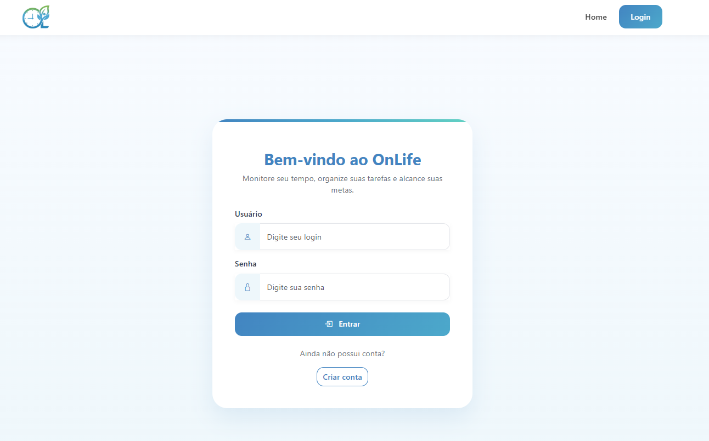
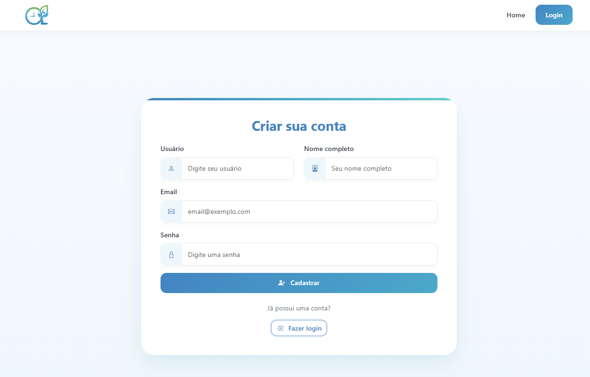
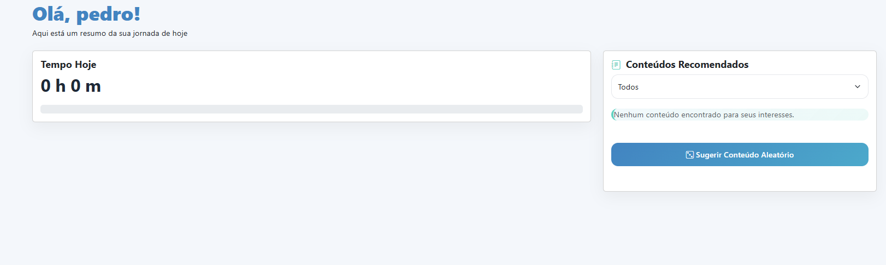
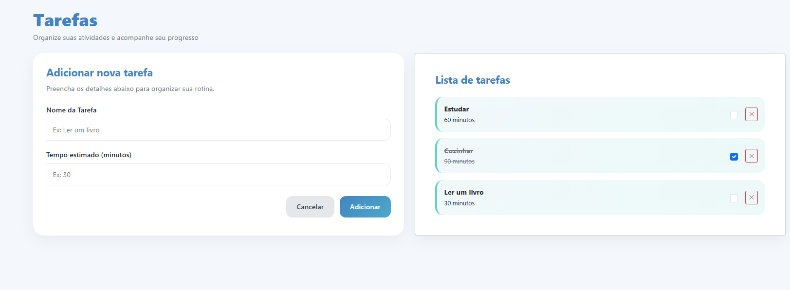
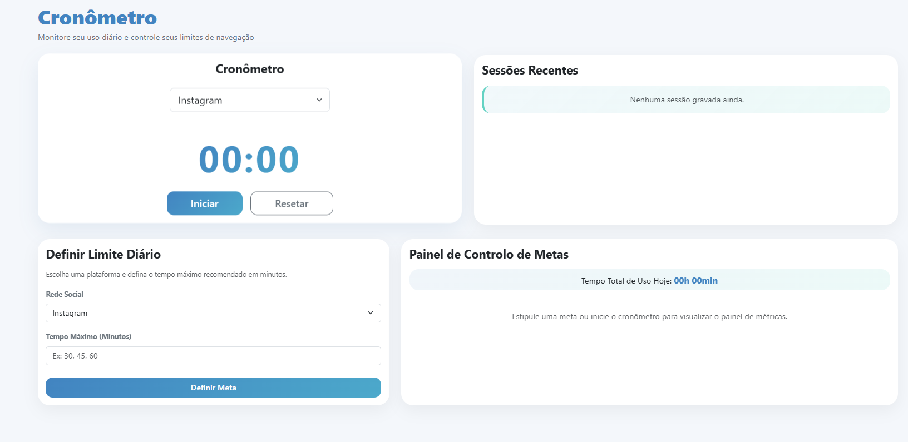
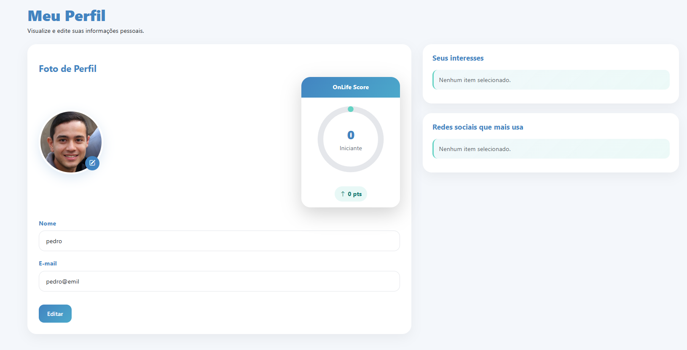
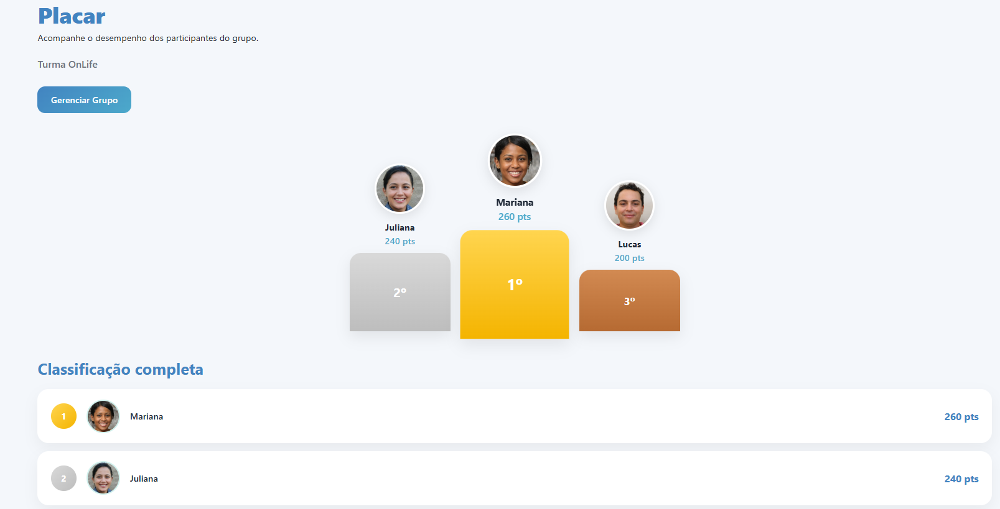
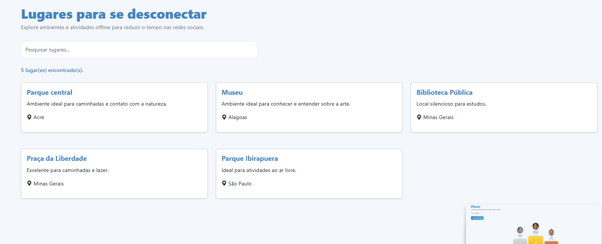

# Arquitetura da solução

O OnLife é uma aplicação web front-end com páginas HTML concentradas em `src/public`, estilos em `src/public/assets/css`, scripts em `src/public/assets/js` e dados de apoio em `src/public/assets/data` e `src/db/db.json`.

Na interface, os dados da aplicação são inicializados e persistidos no `localStorage` e a sessão do usuário logado é mantida no `sessionStorage`.

## Funcionalidades

### Cadastro e login de usuários

Permite criar uma conta, validar login e manter a sessão do usuário durante a navegação.

* **Estruturas de dados:** `usuarios`
* **Instruções de acesso:**
  * Abra o site;
  * clique em login no canto superior da tela;
* **Tela da funcionalidade**:



### Dashboard

Apresenta uma visão resumida da jornada do usuário, incluindo tempo registrado no dia e conteúdos recomendados a partir dos interesses cadastrados.

* **Estruturas de dados:** `usuarios`, `historico_sessoes_cronometro`, `conteudos_recomendados`, `interesses`
* **Instruções de acesso:**
  * Abra o site;
  * faça login;
* **Tela da funcionalidade**:


### Tarefas

Permite cadastrar, concluir e excluir tarefas pessoais. As tarefas concluídas contribuem para o OnLife Score.

* **Estruturas de dados:** `tarefas`, `prioridades`
* **Instruções de acesso:**
  * Abra o site;
  * faça login;
  * clieque em tarefas no sidebar;
* **Tela da funcionalidade**:



### Cronômetro e metas

Permite registrar sessões de uso por rede social e definir limites diários. O histórico alimenta o dashboard.

* **Estruturas de dados:** `redes_sociais`, `historico_sessoes_cronometro`
* **Instruções de acesso:**
  * Abra o site;
  * faça login;
  * clieque em cronometro no sidebar;
* **Tela da funcionalidade**:


### Perfil

Permite visualizar e editar nome, e-mail, foto, interesses e redes sociais do usuário logado.

* **Estruturas de dados:** `usuarios`, `interesses`, `redes_sociais`
* **Instruções de acesso:**
  * Abra o site;
  * faça login;
  * clieque em perfil no sidebar;
* **Tela da funcionalidade**:


### Placar

Exibe um ranking gamificado dos participantes com pontuação por tarefas e controle de tempo.

* **Estruturas de dados:** `placar`
* **Instruções de acesso:**
  * Abra o site;
  * faça login;
  * clieque em placar no sidebar;
* **Tela da funcionalidade**:


### Lugares

Lista sugestões de lugares e atividades offline, com busca por nome ou descrição.

* **Estruturas de dados:** `lugares`, `estados_brasil`
* **Instruções de acesso:**
  * Abra o site;
  * faça login;
  * clieque em lugares no sidebar;
* **Tela da funcionalidade**:


## Estruturas de dados

### Usuários

```json
{
  "id": 1,
  "foto": "assets/images/joao.jpg",
  "nome": "João Silva",
  "login": "joaosilva",
  "senha": "joao123",
  "email": "joao@gmail.com",
  "interesses_ids": [1, 2],
  "redes_sociais": [
    {
      "id": 1,
      "meta_diaria_minutos": 60
    }
  ]
}
```

### Tarefas

```json
{
  "id": 1,
  "id_usuario": 1,
  "titulo": "Ler um livro",
  "descricao": "Ler 30 páginas",
  "tempo_estimado_minutos": 35,
  "data": "2026-07-01",
  "prioridade_id": 1,
  "concluida": false
}
```

### Histórico do cronômetro

```json
{
  "id": 1,
  "id_usuario": 1,
  "id_rede_social": 1,
  "tempo_gasto_minutos": 45,
  "data": "2026-07-01"
}
```

### Conteúdos recomendados

```json
{
  "id": 1,
  "interesses_id": 1,
  "titulo": "@devmais",
  "descricao": "Conteúdos de programação",
  "link": "instagram.com/devmais"
}
```

### Lugares

```json
{
  "id": 1,
  "nome": "Parque central",
  "descricao": "Ambiente ideal para caminhadas e contato com a natureza.",
  "id_estado": 1
}
```

## Módulos e APIs

* **HTML, CSS e JavaScript:** estrutura principal da interface.
* **Bootstrap:** grid, componentes visuais e responsividade.
* **Bootstrap Icons:** ícones dos menus, botões e cartões.
* **LocalStorage:** persistência dos dados da aplicação no navegador.
* **SessionStorage:** controle do usuário logado durante a sessão.
* **Node.js e JSON Server:** ambiente de execução local e servidor de arquivos/API simplificada.


## Hospedagem

A aplicação será realizada por meio da Plataforma Vercel e pode ser acessada com o Link https://2026-1-p1-tiaw-g3-redes-sociais-2.vercel.app/.
